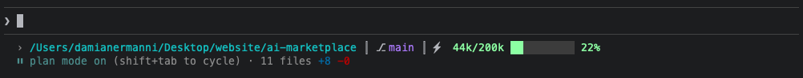

# Statusline Plugin

A customizable statusline for Claude Code that displays essential information at a glance.

## Features

- **Current Directory**: Shows your working directory
- **Session Name**: Displays the current session name (looked up from Claude's internal session index file — this may break in future Claude Code updates as the file is not part of the public API)
- **Git Branch**: Displays the current git branch
- **Context Window Progress**: Visual progress bar showing context usage
  - Mint (green): < 50% usage
  - Amber (yellow): 50-80% usage
  - Coral (red): > 80% usage

## Installation

### Via Setup Command (Recommended)

After installing the plugin, run the setup command:

```
/statusline-setup
```

This will guide you through configuring the statusline for your Claude Code installation.

### Manual Configuration

Add to your `~/.claude/settings.json` (user-wide) or `.claude/settings.local.json` (project-local):

```json
{
  "statusLine": {
    "type": "command",
    "command": "bash ~/.claude/plugins/cache/sdui-marketplace/statusline/0.2.0/scripts/statusline.sh"
  }
}
```

## Requirements

- **jq**: For parsing JSON input from Claude Code

### Installing Dependencies

macOS:
```bash
brew install jq
```

Ubuntu/Debian:
```bash
sudo apt install jq
```

## Example Output



## Customization

The script can be customized by editing the configuration section:

- `BAR_LENGTH`: Number of segments in the progress bar (default: 10)
- `SEP`: Separator character between sections (default: `┃`)
- `SHOW_SESSION`: Show session name in statusline (default: `true`)
- `SHOW_BRANCH`: Show git branch in statusline (default: `true`)
- `MAX_SESSION_LEN`: Truncate session name after N characters (default: 30, set to 0 for no truncation)
- Colors can be adjusted using ANSI color codes

You can also run `/statusline-config` to interactively toggle sections and truncation settings. The `/statusline-setup` command also offers these options during initial setup.

## Troubleshooting

**Statusline not appearing?**
- Restart Claude Code after configuration
- Verify the script path in settings.json is correct

**Git branch not showing?**
- Ensure you're in a git repository
- Check that git is installed and accessible

**Colors not displaying?**
- Ensure your terminal supports 256 colors
- Try setting `TERM=xterm-256color`
